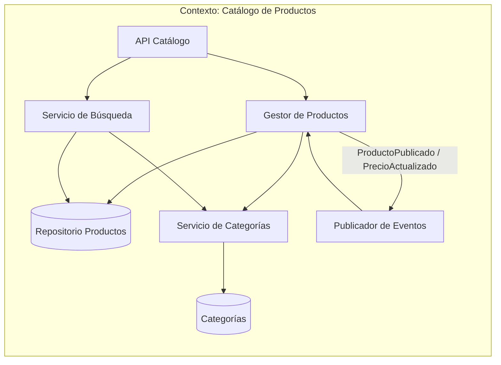
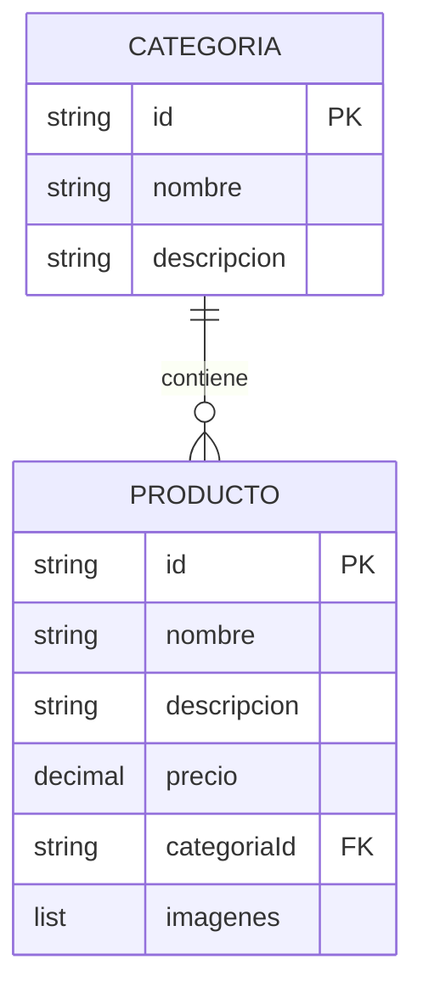
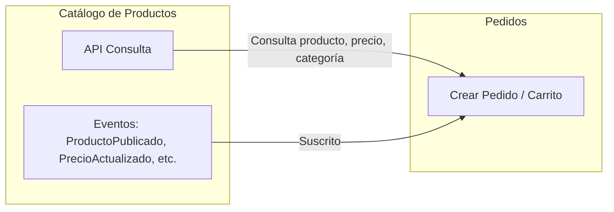
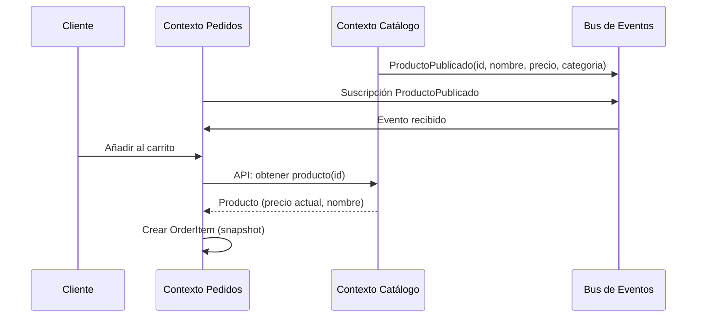

# Contexto delimitado: Catálogo de Productos

## Tabla de contenidos

- [Descripción](#descripción)
- [Responsabilidades](#responsabilidades)
- [Lenguaje ubicuo](#lenguaje-ubicuo)
- [Modelo del dominio](#modelo-del-dominio)
  - [Entidad principal: Producto](#entidad-principal-producto)
  - [Lo que este contexto NO sabe](#lo-que-este-contexto-no-sabe)
- [Eventos](#eventos)
  - [Eventos emitidos](#eventos-emitidos-publicados-por-este-contexto)
  - [Eventos consumidos](#eventos-consumidos-este-contexto-no-depende-de-otros-para-su-modelo)
- [Diagramas](#diagramas)
  - [Comunicación interna](#comunicación-interna-del-contexto)
  - [Agregados y entidades internas](#agregados-y-entidades-internas)
  - [Comunicación con otros contextos](#comunicación-con-otros-contextos-delimitados)
- [Resumen](#resumen)

---

## Descripción

El **Catálogo de Productos** es el contexto responsable de **gestionar qué se vende**. Define y expone la oferta de productos que el cliente puede explorar y comprar. No conoce pagos, compradores ni envíos; solo muestra productos.

## Responsabilidades

- Gestionar **productos** (definición, atributos, precios).
- Gestionar **categorías** y clasificación.
- Mantener **descripciones**, **imágenes** y **ficha técnica**.
- Exponer **precio base** y **inventario visible** (en muchos casos solo lectura para el resto del sistema).

## Lenguaje ubicuo

| Término           | Significado en este contexto                          |
| ----------------- | ----------------------------------------------------- |
| **Producto**      | Item vendible que el cliente puede explorar y comprar |
| **Categoría**     | Clasificación para búsqueda y navegación              |
| **Búsqueda**      | Consulta sobre el catálogo                            |
| **Ficha técnica** | Descripción detallada del producto                    |

## Modelo del dominio

### Entidad principal: Producto

Un **Producto** en este contexto es algo que el cliente puede explorar y comprar.

```
Producto {
  id,
  nombre,
  descripcion,
  precio,
  categoria,
  imagenes
}
```

### Lo que este contexto NO sabe

- Si el pago fue aprobado.
- Quién compró.
- Detalles de envíos.

---

## Eventos

### Eventos emitidos (publicados por este contexto)

| Evento                  | Descripción                                          | Consumidores típicos                     |
| ----------------------- | ---------------------------------------------------- | ---------------------------------------- |
| `ProductoPublicado`     | Un producto nuevo está disponible en el catálogo     | Pedidos (para mostrar en carrito)        |
| `ProductoActualizado`   | Cambios en nombre, descripción, imágenes o categoría | Pedidos (solo referencia)                |
| `PrecioActualizado`     | Cambio del precio base del producto                  | Pedidos (no altera pedidos ya creados)   |
| `ProductoDescontinuado` | El producto deja de estar disponible para compra     | Pedidos (evitar añadir a nuevos pedidos) |
| `InventarioActualizado` | Cambio en stock visible (opcional)                   | Pedidos (validación de disponibilidad)   |

### Eventos consumidos (este contexto no depende de otros para su modelo)

El catálogo suele ser **productor** de información; otros contextos lo consultan o reaccionan a sus eventos. No necesita suscribirse a eventos de Pedidos ni de Envíos para mantener su modelo.

---

## Diagramas

### Comunicación interna del contexto

Flujo típico: gestión del catálogo, publicación y consultas.



### Agregados y entidades internas



### Comunicación con otros contextos delimitados

El catálogo **publica eventos** y puede exponer **APIs de consulta**. Los demás contextos lo usan como fuente de verdad para "qué se vende".





---

## Resumen

| Aspecto             | Detalle                                                                   |
| ------------------- | ------------------------------------------------------------------------- |
| **Responsabilidad** | Gestionar qué se vende (productos, categorías, precios, fichas)           |
| **Producto**        | Item vendible con id, nombre, descripción, precio, categoría, imágenes    |
| **Comunicación**    | Emite eventos de cambios de catálogo; expone API de consulta para Pedidos |
| **Independencia**   | No depende de Pedidos ni Envíos para su modelo                            |
