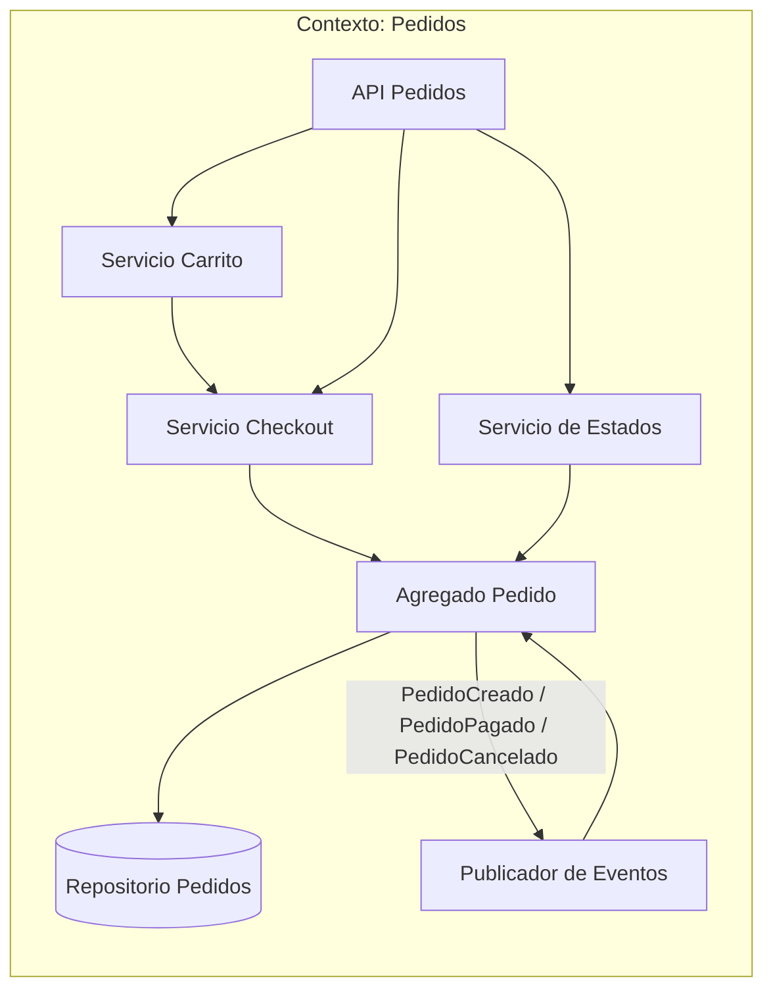
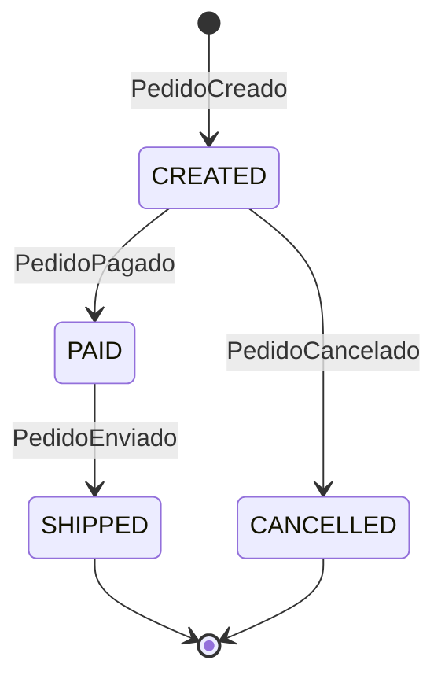
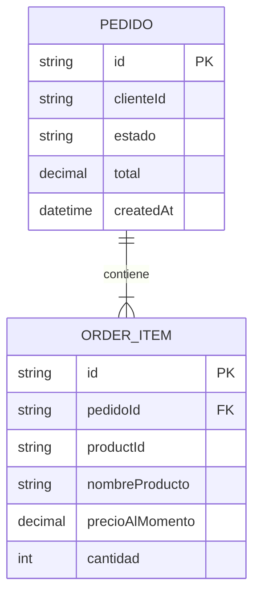
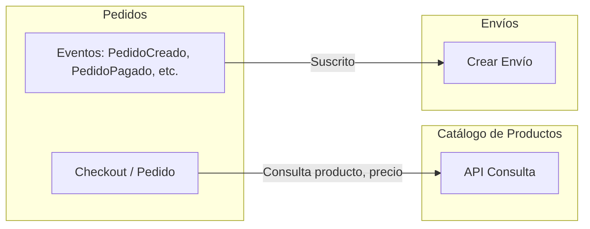
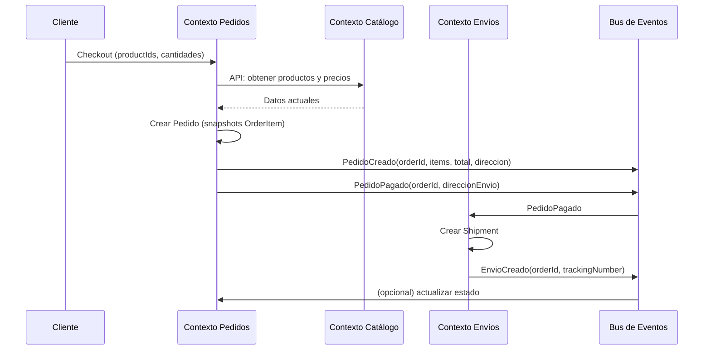

# Contexto delimitado: Pedidos (Order Management)

## Tabla de contenidos

- [Descripción](#descripción)
- [Responsabilidades](#responsabilidades)
- [Lenguaje ubicuo](#lenguaje-ubicuo)
- [Modelo del dominio](#modelo-del-dominio)
  - [Snapshot: OrderItem](#snapshot-orderitem)
  - [Estados típicos del pedido](#estados-típicos-del-pedido)
- [Eventos](#eventos)
  - [Eventos emitidos](#eventos-emitidos-publicados-por-este-contexto)
  - [Eventos consumidos](#eventos-consumidos-de-otros-contextos)
- [Diagramas](#diagramas)
  - [Comunicación interna](#comunicación-interna-del-contexto)
  - [Agregados y flujo de estados](#agregados-y-flujo-de-estados)
  - [Modelo de datos interno](#modelo-de-datos-interno)
  - [Comunicación con otros contextos](#comunicación-con-otros-contextos-delimitados)
  - [Secuencia: de checkout a envío](#secuencia-con-eventos-de-checkout-a-envío)
- [Resumen](#resumen)

---

## Descripción

El contexto de **Pedidos** gestiona la **intención de compra**: creación de pedidos, ítems comprados, totales, estados e historial. Aquí un "producto" no es el producto completo del catálogo, sino un **snapshot** (copia en el momento del pedido) para fijar precio y nombre aunque el catálogo cambie después.

## Responsabilidades

- **Crear pedidos** a partir del carrito o checkout.
- Gestionar el **estado del pedido** (CREATED, PAID, SHIPPED, CANCELLED).
- Mantener **ítems comprados** con precio y cantidad.
- Calcular y almacenar **totales**.
- Conservar **historial** del ciclo de vida del pedido.

## Lenguaje ubicuo

| Término      | Significado en este contexto                           |
| ------------ | ------------------------------------------------------ |
| **Pedido**   | Intención de compra con ítems y estado                 |
| **Checkout** | Proceso de confirmación antes de crear el pedido       |
| **Carrito**  | Conjunto de ítems pendientes de confirmar (pre-pedido) |
| **Estado**   | CREATED, PAID, SHIPPED, CANCELLED                      |

## Modelo del dominio

### Snapshot: OrderItem

En este contexto un "producto" es solo una **copia en el momento de la compra**:

```
OrderItem {
  productId,
  nombreProducto,
  precioAlMomento,
  cantidad
}
```

El pedido guarda el **precio histórico** aunque el catálogo cambie después.

### Estados típicos del pedido

| Estado        | Descripción                                    |
| ------------- | ---------------------------------------------- |
| **CREATED**   | Pedido creado, pendiente de pago               |
| **PAID**      | Pago confirmado                                |
| **SHIPPED**   | Marcado como enviado (coordinación con Envíos) |
| **CANCELLED** | Pedido cancelado                               |

---

## Eventos

### Eventos emitidos (publicados por este contexto)

| Evento            | Descripción                                         | Consumidores típicos                                         |
| ----------------- | --------------------------------------------------- | ------------------------------------------------------------ |
| `PedidoCreado`    | Nuevo pedido con ítems y totales                    | Envíos (para preparar envío), notificaciones                 |
| `PedidoPagado`    | Pago confirmado; pedido listo para enviar           | Envíos (crear envío/paquete)                                 |
| `PedidoCancelado` | Pedido cancelado                                    | Envíos (cancelar envío), Catálogo (devolver stock si aplica) |
| `PedidoEnviado`   | Pedido marcado como enviado (puede venir de Envíos) | Notificaciones, reporting                                    |

### Eventos consumidos (de otros contextos)

| Evento                                                            | Origen   | Uso en Pedidos                                   |
| ----------------------------------------------------------------- | -------- | ------------------------------------------------ |
| `ProductoPublicado`, `PrecioActualizado`, `ProductoDescontinuado` | Catálogo | Validar ítems en carrito y al hacer checkout     |
| `EnvioEntregado` (opcional)                                       | Envíos   | Pasar pedido a estado "entregado" o cerrar ciclo |

---

## Diagramas

### Comunicación interna del contexto

Flujo: carrito → checkout → pedido → estados.



### Agregados y flujo de estados



### Modelo de datos interno



### Comunicación con otros contextos delimitados

Pedidos **consume** datos del Catálogo (consulta) y **publica** eventos que Envíos usa para crear y gestionar envíos.



### Secuencia con eventos: de checkout a envío



---

## Resumen

| Aspecto             | Detalle                                                                                    |
| ------------------- | ------------------------------------------------------------------------------------------ |
| **Responsabilidad** | Gestionar intención de compra: pedidos, ítems, totales, estados                            |
| **Producto**        | Snapshot: OrderItem (productId, nombreProducto, precioAlMomento, cantidad)                 |
| **Estados**         | CREATED → PAID → SHIPPED, o CANCELLED                                                      |
| **Comunicación**    | Consulta Catálogo; publica PedidoCreado, PedidoPagado, PedidoCancelado para Envíos y otros |
