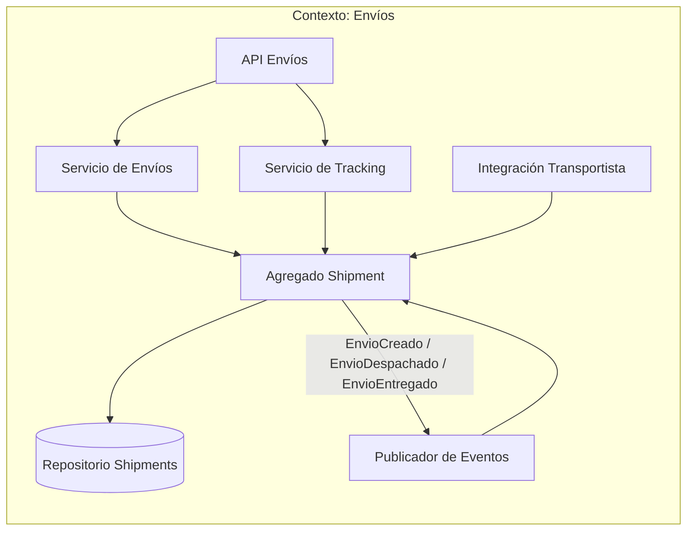
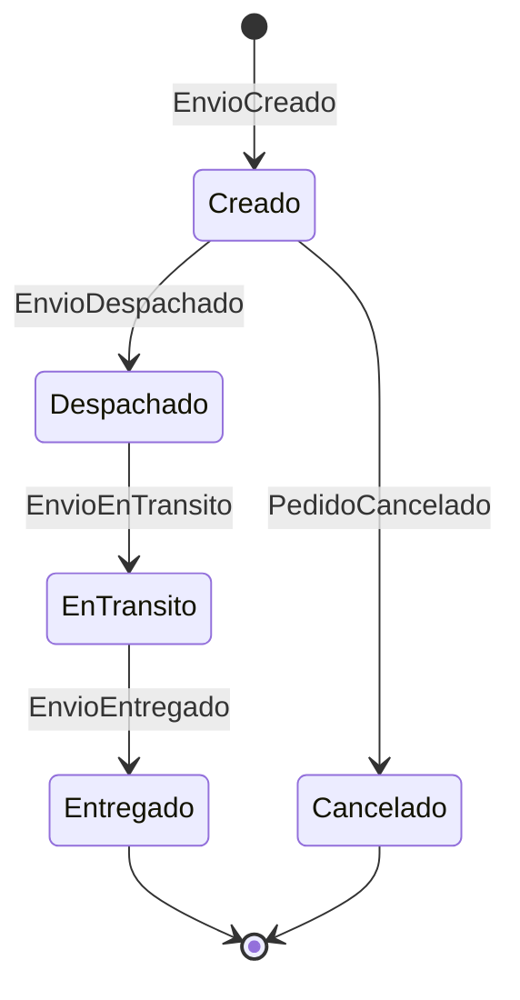
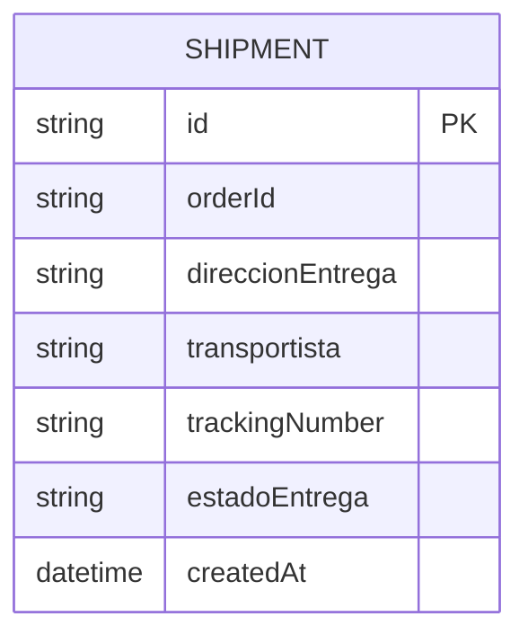
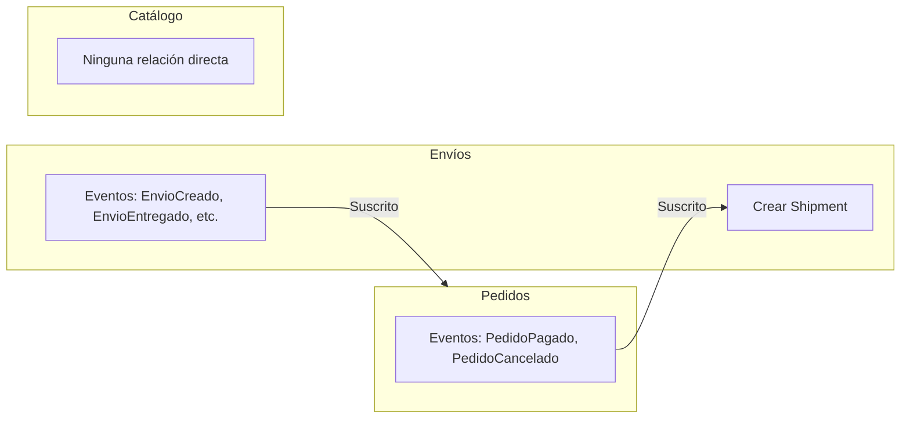
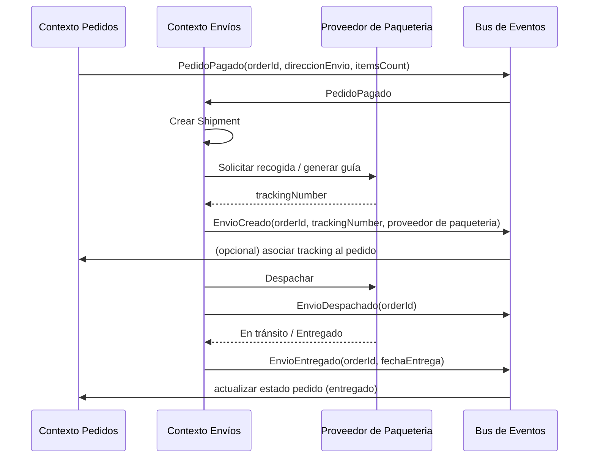

# Contexto delimitado: Envíos (Shipping / Logistics)

## Tabla de contenidos

- [Descripción](#descripción)
- [Responsabilidades](#responsabilidades)
- [Lenguaje ubicuo](#lenguaje-ubicuo)
- [Modelo del dominio](#modelo-del-dominio)
  - [Entidad principal: Shipment](#entidad-principal-shipment-envío)
  - [Lo que este contexto NO sabe](#lo-que-este-contexto-no-sabe)
- [Eventos](#eventos)
  - [Eventos emitidos](#eventos-emitidos-publicados-por-este-contexto)
  - [Eventos consumidos](#eventos-consumidos-de-otros-contextos)
- [Diagramas](#diagramas)
  - [Comunicación interna](#comunicación-interna-del-contexto)
  - [Ciclo de vida del envío](#ciclo-de-vida-del-envío-estados)
  - [Modelo de datos interno](#modelo-de-datos-interno)
  - [Comunicación con otros contextos](#comunicación-con-otros-contextos-delimitados)
  - [Secuencia: PedidoPagado a EnvioEntregado](#secuencia-de-pedidopagado-a-envioentregado)
- [Resumen](#resumen)

---

## Descripción

El contexto de **Envíos** gestiona **cómo llega el pedido al cliente**: dirección de envío, transportista, tracking y estado de la entrega. Aquí un "pedido" no es el carrito ni los ítems comprados, sino la **referencia a un paquete físico** que hay que transportar y entregar.

## Responsabilidades

- Gestionar **dirección de envío** y datos de entrega.
- Asignar **transportista** y **costos de envío**.
- Gestionar **tracking** (número de guía, seguimiento).
- Gestionar **entregas** y estados (en preparación, enviado, en tránso, entregado).

## Lenguaje ubicuo

| Término     | Significado en este contexto                        |
| ----------- | --------------------------------------------------- |
| **Envío**   | Paquete físico a transportar hasta el cliente       |
| **Paquete** | Unidad de carga asociada a un pedido                |
| **Guía**    | Número de seguimiento (tracking)                    |
| **Entrega** | Acto de dejar el paquete en la dirección de destino |

## Modelo del dominio

### Entidad principal: Shipment (Envío)

Un "pedido" en este contexto es **un paquete a transportar**:

```
Shipment {
  orderId,
  direccionEntrega,
  transportista,
  trackingNumber,
  estadoEntrega
}
```

### Lo que este contexto NO sabe

- Detalles del pago.
- Catálogo completo de productos.
- Promociones o descuentos aplicados al pedido.

Solo necesita: **qué pedido** enviar y **a dónde** (dirección de entrega).

---

## Eventos

### Eventos emitidos (publicados por este contexto)

| Evento            | Descripción                                                              | Consumidores típicos                       |
| ----------------- | ------------------------------------------------------------------------ | ------------------------------------------ |
| `EnvioCreado`     | Se creó un envío para un pedido (orderId, trackingNumber, transportista) | Pedidos (asociar tracking), notificaciones |
| `EnvioDespachado` | El paquete salió del almacén / centro de distribución                    | Pedidos, notificaciones al cliente         |
| `EnvioEnTransito` | El paquete está en camino                                                | Notificaciones, seguimiento                |
| `EnvioEntregado`  | El paquete fue entregado en destino                                      | Pedidos (cerrar ciclo), notificaciones     |

### Eventos consumidos (de otros contextos)

| Evento            | Origen  | Uso en Envíos                                           |
| ----------------- | ------- | ------------------------------------------------------- |
| `PedidoPagado`    | Pedidos | Crear el Shipment y asignar transportista/dirección     |
| `PedidoCancelado` | Pedidos | Cancelar o no crear el envío; anular tracking si aplica |

---

## Diagramas

### Comunicación interna del contexto

Flujo: creación de envío, asignación de transportista, tracking y actualización de estado.



### Ciclo de vida del envío (estados)



### Modelo de datos interno



### Comunicación con otros contextos delimitados

Envíos **solo reacciona a eventos de Pedidos** (PedidoPagado, PedidoCancelado) y **publica** eventos de estado para que Pedidos y otros sistemas actualicen su vista.



### Secuencia: de PedidoPagado a EnvioEntregado



---

## Resumen

| Aspecto             | Detalle                                                                                     |
| ------------------- | ------------------------------------------------------------------------------------------- |
| **Responsabilidad** | Gestionar cómo llega el pedido: dirección, transportista, tracking, entrega                 |
| **Pedido**          | Referencia (orderId) + dirección + transportista + tracking + estado de entrega             |
| **Comunicación**    | Consume PedidoPagado, PedidoCancelado; publica EnvioCreado, EnvioDespachado, EnvioEntregado |
| **Independencia**   | No conoce pago, catálogo ni promociones; solo orderId y dirección de entrega                |
