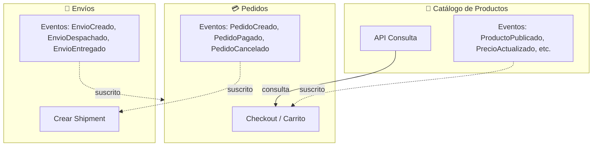
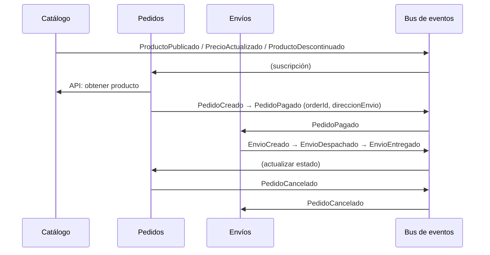

# Ejemplo Tarea #1: Contextos delimitados (Catálogo, Pedidos, Envíos)

Tres contextos que se comunican por **APIs** (consulta) y **eventos** (publicación/suscripción). Documentación detallada en los archivos enlazados abajo.

## Tabla de contenidos

- [Contextos y documentación](#contextos-y-documentación)
- [Diagrama: interacción entre contextos](#diagrama-interacción-entre-contextos)
  - [Flujo de eventos (secuencia)](#flujo-de-eventos-secuencia)
- [Eventos por contexto](#eventos-por-contexto)
- [Resumen de cada contexto](#resumen-de-cada-contexto)

---

## Contextos y documentación

| Contexto                  | Responsabilidad                           | Documentación                                                          |
| ------------------------- | ----------------------------------------- | ---------------------------------------------------------------------- |
| **Catálogo de Productos** | Gestionar qué se vende                    | [01-contexto-catalogo-productos.md](01-contexto-catalogo-productos.md) |
| **Pedidos**               | Gestionar la intención de compra          | [02-contexto-pedidos.md](02-contexto-pedidos.md)                       |
| **Envíos**                | Gestionar cómo llega el pedido al cliente | [03-contexto-envios.md](03-contexto-envios.md)                         |

---

## Diagrama: interacción entre contextos

- **Líneas sólidas**: API (Pedidos consulta producto/precio al Catálogo).
- **Líneas punteadas**: eventos (Catálogo → Pedidos; Pedidos → Envíos; Envíos → Pedidos).

### Flujo de eventos (secuencia)

---

## Eventos por contexto

| Contexto     | Emite                                                          | Consume                                 |
| ------------ | -------------------------------------------------------------- | --------------------------------------- |
| **Catálogo** | ProductoPublicado, PrecioActualizado, ProductoDescontinuado, … | —                                       |
| **Pedidos**  | PedidoCreado, PedidoPagado, PedidoCancelado, PedidoEnviado     | Eventos Catálogo; (opc.) EnvioEntregado |
| **Envíos**   | EnvioCreado, EnvioDespachado, EnvioEnTransito, EnvioEntregado  | PedidoPagado, PedidoCancelado           |

---

## Resumen de cada contexto

- **Catálogo:** Producto = item vendible (`id`, `nombre`, `precio`, `categoria`, `imagenes`). No sabe pagos ni envíos.
- **Pedidos:** “Producto” = snapshot `OrderItem { productId, nombreProducto, precioAlMomento, cantidad }`. Estados: CREATED → PAID → SHIPPED o CANCELLED.
- **Envíos:** “Pedido” = paquete a transportar `Shipment { orderId, direccionEntrega, transportista, trackingNumber, estadoEntrega }`. No sabe catálogo ni pago.

El mismo concepto cambia de significado por contexto:

| Concepto     | Catálogo      | Pedidos           | Envíos       |
| ------------ | ------------- | ----------------- | ------------ |
| **Producto** | Item vendible | Snapshot comprado | Solo orderId |
| **Cliente**  | Visitante     | Comprador         | Destinatario |
| **Precio**   | Actual        | Histórico         | Irrelevante  |

Un contexto delimitado protege el significado del modelo dentro de sus fronteras.

**Microservicios típicos:** Catalog Service, Order Service, Shipping Service — cada uno con su BD, modelo y comunicación por eventos o APIs.
