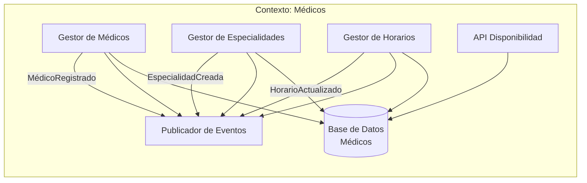
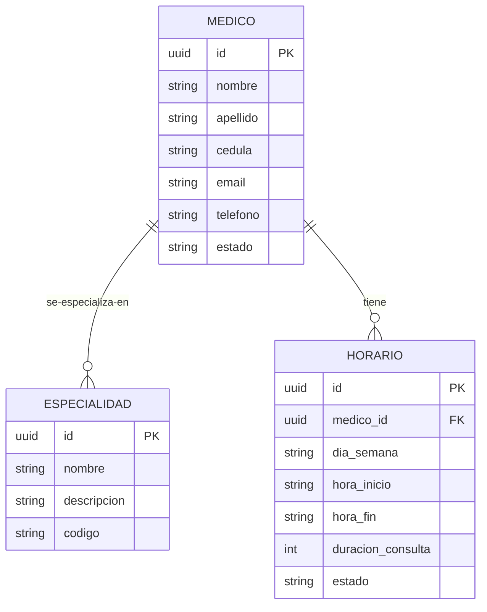
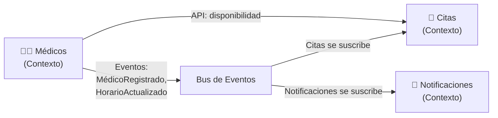

# Contexto delimitado: Médicos

## Tabla de contenidos

- [Descripción](#descripción)
- [Responsabilidades](#responsabilidades)
- [Lenguaje ubicuo](#lenguaje-ubicuo)
- [Modelo del dominio](#modelo-del-dominio)
  - [Entidades principales](#entidades-principales)
  - [Lo que este contexto NO sabe](#lo-que-este-contexto-no-sabe)
- [Eventos](#eventos)
  - [Eventos emitidos](#eventos-emitidos-publicados-por-este-contexto)
  - [Eventos consumidos](#eventos-consumidos)
- [Diagramas](#diagramas)
  - [Comunicación interna](#comunicación-interna-del-contexto)
  - [Agregados y entidades internas](#agregados-y-entidades-internas)
  - [Comunicación con otros contextos](#comunicación-con-otros-contextos-delimitados)
- [API](#api)
- [Resumen](#resumen)

---

## Descripción

El **Contexto de Médicos** es responsable de **gestionar médicos, sus especialidades y horarios disponibles**. Define quiénes son los profesionales, en qué se especializan y cuándo están disponibles. No conoce pacientes específicos ni detalles de citas confirmadas; solo expone disponibilidad.

## Responsabilidades

- Registrar y gestionar **médicos** (profesionales).
- Gestionar **especialidades** (cardiología, pediatría, etc.).
- Mantener **horarios de trabajo** (días, horas disponibles).
- Exponer **disponibilidad** para que otros contextos consulten.
- Mantener información de **contacto** y **credenciales**.

## Lenguaje ubicuo

| Término            | Significado en este contexto                          |
| ------------------ | ----------------------------------------------------- |
| **Médico**         | Profesional sanitario con especialidad(s) definida(s) |
| **Especialidad**   | Campo médico en el que el médico se especializa       |
| **Horario**        | Período de tiempo en el que el médico atiende         |
| **Disponibilidad** | Consulta externa: ¿está libre este médico este día?   |
| **Jornada**        | Bloque de tiempo determinado (ej: lunes 9am-1pm)      |

## Modelo del dominio

### Entidades principales

Un **Médico** en este contexto es un profesional con una o más especialidades:

```
Médico {
  id: UUID,
  nombre: string,
  apellido: string,
  cédula: string (identificación única),
  especialidades: Especialidad[],
  horarios: Horario[],
  email: string,
  teléfono: string,
  estado: "activo" | "inactivo"
}

Especialidad {
  id: UUID,
  nombre: string,
  descripción: string,
  código: string
}

Horario {
  id: UUID,
  médico_id: UUID,
  día_semana: "lunes" | "martes" | ... | "domingo",
  hora_inicio: HH:mm,
  hora_fin: HH:mm,
  duración_consulta: número (minutos),
  estado: "activo" | "inactivo"
}
```

### Lo que este contexto NO sabe

- **Pacientes**: No almacena datos de pacientes. No sabe quién se va a atender con cada médico.
- **Pagos**: No sabe de costos, seguros o transacciones.
- **Historial médico**: No es un EHR (Electronic Health Record). No almacena diagnósticos ni tratamientos.
- **Citas confirmadas**: No sabe cuántas citas hay reservadas. Solo expone disponibilidad.

---

## Eventos

### Eventos emitidos (publicados por este contexto)

| Evento                 | Cuándo                                                     | Datos                                       |
| ---------------------- | ---------------------------------------------------------- | ------------------------------------------- |
| **MédicoRegistrado**   | Un nuevo médico se registra en el sistema                  | `médicoId, nombre, especialidades`          |
| **MédicoDesactivado**  | Un médico se retira o se desactiva                         | `médicoId`                                  |
| **EspecialidadCreada** | Se define una nueva especialidad                           | `especialidadId, nombre, descripción`       |
| **HorarioActualizado** | El horario de un médico cambia (ej: ahora atiende viernes) | `médicoId, horarios[]`                      |
| **HorarioBloqueado**   | Un médico bloquea un horario (vacaciones, etc.)            | `médicoId, fecha_inicio, fecha_fin, motivo` |

### Eventos consumidos

**Este contexto no consume eventos de otros contextos**. Es autónomo en su modelo. (Es posible que en el futuro consuma eventos de un contexto de "Turnos Especiales" si existiera.)

---

## Diagramas

### Comunicación interna del contexto

Flujo de gestión de médicos, especialidades y horarios:



### Agregados y entidades internas

Relaciones entre Médicos, Especialidades y Horarios:



### Comunicación con otros contextos delimitados

El contexto de **Médicos** es **productor de información**. Otros contextos lo consultan para validar disponibilidad:



---

## API

El contexto de **Médicos** expone una API consultiva para que otros contextos validen disponibilidad:

```
GET /médicos/disponibilidad?
  especialidad_id=UUID&
  fecha=YYYY-MM-DD&
  hora_inicio=HH:mm&
  hora_fin=HH:mm

Respuesta:
[
  {
    "médico_id": UUID,
    "nombre": string,
    "especialidad": string,
    "disponible": boolean,
    "próximos_slots": ["09:00", "09:30", "10:00"]
  }
]
```

---

## Resumen

**El Contexto de Médicos es la fuente de verdad sobre disponibilidad**. Otros contextos consultan aquí antes de reservar. Emite eventos cuando hay cambios (nuevos médicos, nuevos horarios) para que sistemas dependientes se actualicen.

- **Autonomía**: Gestiona su propia lista de profesionales y horarios.
- **Publicativo**: Otros contextos consultan su API o se suscriben a sus eventos.
- **Protección del modelo**: Internamente un médico es complejo; externamente solo expone ID y disponibilidad.
