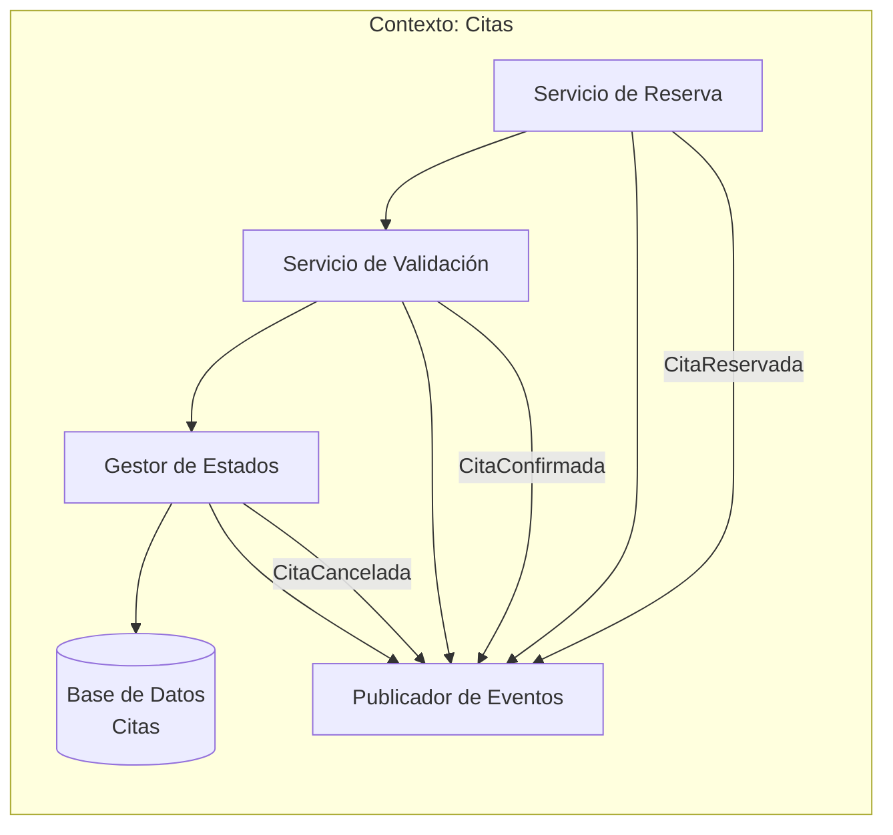
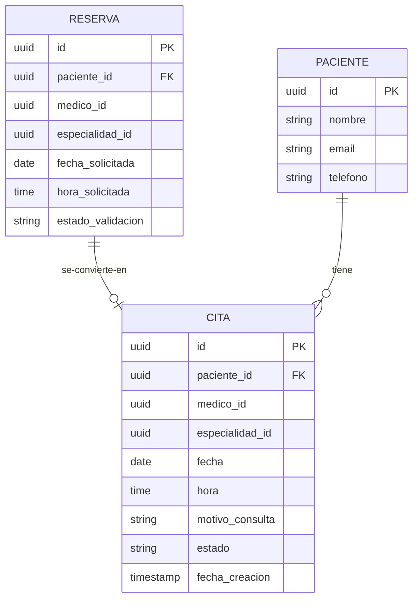
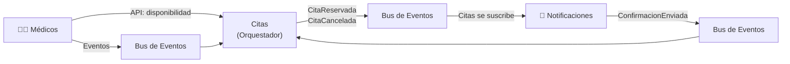

# Contexto delimitado: Citas

## Tabla de contenidos

- [Descripción](#descripción)
- [Responsabilidades](#responsabilidades)
- [Lenguaje ubicuo](#lenguaje-ubicuo)
- [Modelo del dominio](#modelo-del-dominio)
  - [Entidades principales](#entidades-principales)
  - [Lo que este contexto NO sabe](#lo-que-este-contexto-no-sabe)
- [Eventos](#eventos)
  - [Eventos emitidos](#eventos-emitidos-publicados-por-este-contexto)
  - [Eventos consumidos](#eventos-consumidos)
- [Diagramas](#diagramas)
  - [Comunicación interna](#comunicación-interna-del-contexto)
  - [Agregados y entidades internas](#agregados-y-entidades-internas)
  - [Comunicación con otros contextos](#comunicación-con-otros-contextos-delimitados)
- [API consumidas](#api-consumidas)
- [Estados de una cita](#estados-de-una-cita)
- [Resumen](#resumen)

---

## Descripción

El **Contexto de Citas** es el corazón del sistema. Es responsable de **gestionar la reserva, confirmación y cancelación de citas médicas**. Coordina entre pacientes y médicos, validando disponibilidad.

## Responsabilidades

- Permitir que los **pacientes reserven citas** con un médico específico.
- **Validar disponibilidad** consultando el contexto de Médicos.
- Gestionar **cancelaciones** de citas.
- Mantener el **estado** de cada cita (reservada, confirmada, completada, cancelada).
- Generar **confirmaciones** cuando se reserva.
- Prevenir **dobles reservas** (dos pacientes en el mismo slot).

## Lenguaje ubicuo

| Término          | Significado en este contexto                      |
| ---------------- | ------------------------------------------------- |
| **Cita**         | Reserva confirmada de un paciente con un médico   |
| **Paciente**     | Persona que busca atenderse (usuário del sistema) |
| **Médico**       | Referencia al profesional (ID + especialidad)     |
| **Slot**         | Intervalo de tiempo disponible para reservar      |
| **Reserva**      | Intención de tomar una cita (no confirmada aún)   |
| **Confirmación** | Estado de validación y envío de datos de la cita  |

## Modelo del dominio

### Entidades principales

Una **Cita** es una reserva confirmada:

```
Cita {
  id: UUID,
  paciente_id: UUID,
  paciente_nombre: string,
  paciente_email: string,
  paciente_teléfono: string,
  médico_id: UUID,
  especialidad_id: UUID,
  fecha: YYYY-MM-DD,
  hora: HH:mm,
  duración: número (minutos),
  motivo_consulta: string (opcional),
  estado: CítaEstado,
  fecha_creación: timestamp,
  fecha_último_cambio: timestamp,
  notas_internas: string
}

enum CítaEstado {
  RESERVADA = "reservada",      // Acaba de reservar
  CONFIRMADA = "confirmada",    // Ya se envió confirmación
  COMPLETADA = "completada",    // Ya pasó la fecha
  CANCELADA = "cancelada"       // Cancelada por paciente o médico
}

Reserva {
  id: UUID,
  paciente_id: UUID,
  médico_id: UUID,
  especialidad_id: UUID,
  fecha_solicitada: YYYY-MM-DD,
  hora_solicitada: HH:mm,
  estado_validación: "pendiente" | "válida" | "rechazada",
  motivo_rechazo: string (opcional),
  timestamp: timestamp
}
```

### Lo que este contexto NO sabe

- **Perfil médico completo**: Solo tiene ID, especialidad e ID de disponibilidad. No almacena nombre, credenciales, etc.
- **Historial médico del paciente**: No sabe diagnósticos previos ni información clínica.
- **Pagos**: No maneja transacciones ni costos de las citas.
- **Detalles de logística de envío**: No es su responsabilidad.
- **Cómo se notifica**: Solo emite el evento; Notificaciones decide cómo contactar.

---

## Eventos

### Eventos emitidos (publicados por este contexto)

| Evento             | Cuándo                                              | Datos                                                    |
| ------------------ | --------------------------------------------------- | -------------------------------------------------------- |
| **CitaReservada**  | Un paciente reserva una cita con éxito              | `citaId, pacienteId, médicoId, fecha, hora`              |
| **CitaConfirmada** | La reserva se confirma (validación pasó)            | `citaId, pacienteId, médicoId, fecha, hora`              |
| **CitaCancelada**  | Se cancela una cita (paciente o médico)             | `citaId, pacienteId, médicoId, motivo, fechaCancelación` |
| **CitaRechazada**  | No hay disponibilidad; rechazo de reserva           | `reservaId, pacienteId, médicoId, motivo`                |
| **CitaRealizada**  | Después de la fecha programada (manual/asincrónico) | `citaId, pacienteId, médicoId, fecha`                    |

### Eventos consumidos

| Evento                  | De Contexto    | Acción                                        |
| ----------------------- | -------------- | --------------------------------------------- |
| **HorarioActualizado**  | Médicos        | Valida que citas futuras sigan siendo válidas |
| **MédicoDesactivado**   | Médicos        | Cancela citas del médico inactivo             |
| **ConfirmacionEnviada** | Notificaciones | Marca cita como confirmada en BDD             |

---

## Diagramas

### Comunicación interna del contexto

Flujo de creación, validación y gestión de citas:



### Agregados y entidades internas

Relaciones entre Citas y Reservas:



### Comunicación con otros contextos delimitados

El contexto de **Citas** es **orquestador**: consume de Médicos, produce para Notificaciones:



---

## API consumidas

**Consulta a Contexto de Médicos:**

```
GET /médicos/disponibilidad?
  especialidad_id=UUID&
  fecha=YYYY-MM-DD&
  hora_inicio=HH:mm&
  hora_fin=HH:mm

Respuesta:
{
  "disponible": boolean,
  "doctor_id": UUID,
  "próximos_slots": ["09:00", "09:30", "10:00"]
}
```

---

## Estados de una cita

```
RESERVADA → CONFIRMADA → COMPLETADA
                      ↓
                    CANCELADA
```

- **RESERVADA**: El paciente acaba de hacer clic en "Reservar". Pendiente confirmación del sistema.
- **CONFIRMADA**: Se validó que el slot sigue disponible. Notificación enviada al paciente.
- **COMPLETADA**: El día de la cita pasó (puede ser automático o manual).
- **CANCELADA**: Cancellada antes de completarse.

---

## Resumen

**El Contexto de Citas es el orquestador**. Coordina la interacción entre Médicos (consulta disponibilidad) y Notificaciones (notifica cambios). Emite eventos cada vez que hay un cambio, permitiendo que otros contextos reaccionen sin acoplamiento directo.

- **Responsabilidad clara**: Gestionar solo la lógica de reserva.
- **Reactividad**: Consume eventos de Médicos y Notificaciones para mantenerse actualizado.
- **Protección del modelo**: Un "médico" aquí no es igual que en el Contexto de Médicos; es solo una referencia.
