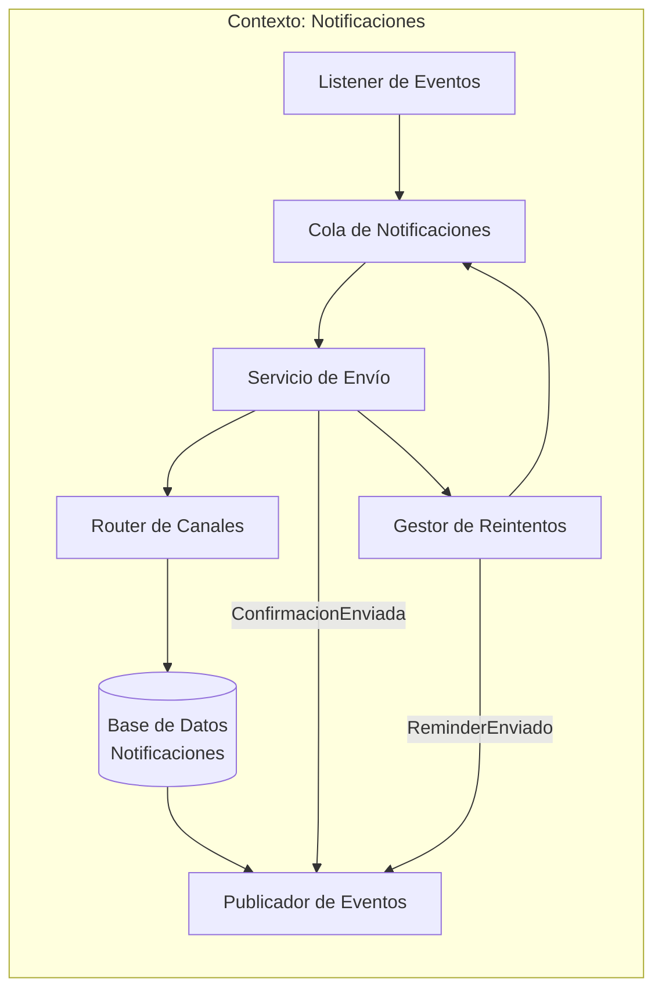
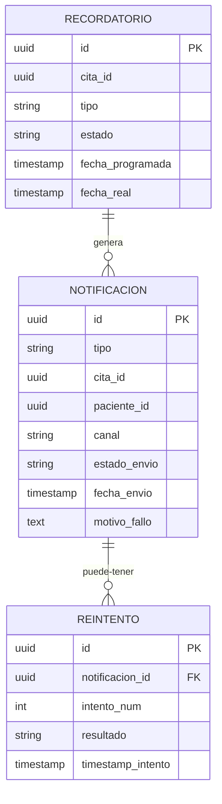
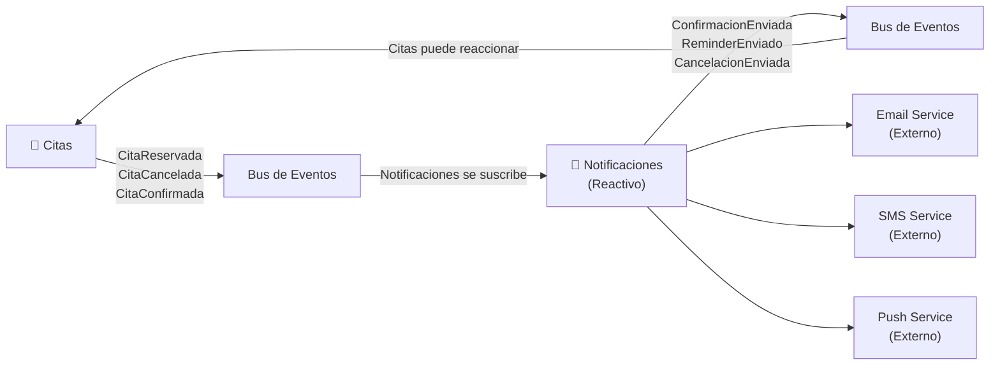

# Contexto delimitado: Notificaciones

## Tabla de contenidos

- [Descripción](#descripción)
- [Responsabilidades](#responsabilidades)
- [Lenguaje ubicuo](#lenguaje-ubicuo)
- [Modelo del dominio](#modelo-del-dominio)
  - [Entidades principales](#entidades-principales)
  - [Lo que este contexto NO sabe](#lo-que-este-contexto-no-sabe)
- [Eventos](#eventos)
  - [Eventos emitidos](#eventos-emitidos-publicados-por-este-contexto)
  - [Eventos consumidos](#eventos-consumidos)
- [Diagramas](#diagramas)
  - [Comunicación interna](#comunicación-interna-del-contexto)
  - [Agregados y entidades internas](#agregados-y-entidades-internas)
  - [Comunicación con otros contextos](#comunicación-con-otros-contextos-delimitados)
- [Canales de notificación](#canales-de-notificación)
- [Resumen](#resumen)

---

## Descripción

El **Contexto de Notificaciones** es responsable de **enviar recordatorios y confirmaciones** a los pacientes cuando sus citas cambian. Es completamente reactivo: espera eventos de otros contextos y ejecuta acciones de notificación.

## Responsabilidades

- Enviar **confirmación** cuando se reserva una cita.
- Enviar **recordatorios** días antes de la cita (ej: 2 días antes).
- Enviar **notificaciones de cancelación** cuando se cancela una cita.
- Elegir **canal de comunicación** (Email, SMS, push notification).
- Registrar **intentos y estado** de cada notificación enviada.
- Reintentar en caso de fallos (ej: email rechazado).

## Lenguaje ubicuo

| Término          | Significado en este contexto                             |
| ---------------- | -------------------------------------------------------- |
| **Notificación** | Mensaje enviado a un paciente sobre su cita              |
| **Confirmación** | Notificación enviada inmediatamente tras reservar        |
| **Recordatorio** | Notificación periódica (ej: 2 días antes)                |
| **Canal**        | Medio de envío (Email, SMS, Push)                        |
| **Paciente**     | Destinatario de la notificación (datos contacto)         |
| **Cita**         | Evento que disparó la notificación (no detalles médicos) |

## Modelo del dominio

### Entidades principales

Una **Notificación** es un registro de comunicación:

```
Notificación {
  id: UUID,
  tipo: TipoNotificación,
  cita_id: UUID,
  paciente_id: UUID,
  paciente_email: string,
  paciente_teléfono: string,
  canal: "email" | "sms" | "push",
  asunto: string,
  contenido: string,
  estado_envío: "pendiente" | "enviado" | "fallido" | "no_reintentable",
  fecha_envío: timestamp (null si no se envió),
  motivo_fallo: string (opcional),
  intentos: número,
  máx_intentos: número,
  próximo_reintento: timestamp (opcional)
}

enum TipoNotificación {
  CONFIRMACIÓN_CITA = "confirmación",
  RECORDATORIO = "recordatorio",
  CANCELACIÓN = "cancelación",
  RESCHEDULING = "reprogramación"
}

Recordatorio {
  id: UUID,
  cita_id: UUID,
  tipo: "24h" | "48h" | "1_semana",
  estado: "pendiente" | "programado" | "enviado" | "cancelado",
  fecha_envío_programada: timestamp,
  fecha_envío_real: timestamp (null si no se envió)
}
```

### Lo que este contexto NO sabe

- **Quién es realmente el paciente**: Solo tiene email/teléfono. No almacena historial médico.
- **Detalles médicos de la cita**: No sabe qué especialidad, qué diagnóstico, ni quién es el médico específico.
- **Reglas de disponibilidad de médicos**: No valida horarios ni especialidades.
- **Confirmación de asistencia**: No sabe si el paciente realmente fue a la cita.
- **Pagos o costos**: No sabe si la cita fue cobrada o facturada.

---

## Eventos

### Eventos emitidos (publicados por este contexto)

| Evento                  | Cuándo                                            | Datos                                     |
| ----------------------- | ------------------------------------------------- | ----------------------------------------- |
| **ConfirmacionEnviada** | Email/SMS de confirmación fue enviado con éxito   | `notificaciónId, citaId, timestamp`       |
| **ReminderEnviado**     | Recordatorio fue enviado con éxito                | `recordatorioId, citaId, timestamp, tipo` |
| **CancelacionEnviada**  | Notificación de cancelación fue enviada           | `notificaciónId, citaId, timestamp`       |
| **NotificacionFallida** | Falló envío de notificación después de reintentos | `notificaciónId, motivo, tipo`            |

### Eventos consumidos

| Evento             | De Contexto | Acción                                                   |
| ------------------ | ----------- | -------------------------------------------------------- |
| **CitaReservada**  | Citas       | Enqueue notificación de confirmación                     |
| **CitaCancelada**  | Citas       | Enqueue notificación de cancelación                      |
| **CitaConfirmada** | Citas       | Programar recordatorios para 2 días antes y 1 hora antes |

---

## Diagramas

### Comunicación interna del contexto

Flujo reactivo: escuchar eventos, colar y enviar notificaciones:



### Agregados y entidades internas

Relaciones entre Notificaciones y Recordatorios:



### Comunicación con otros contextos delimitados

El contexto de **Notificaciones** es **completamente reactivo**: consume eventos, nunca consulta:



---

## Canales de notificación

Este contexto soporta múltiples canales sin afectar los demás contextos:

| Canal | Tecnología               | Ventajas                         | Limitaciones           |
| ----- | ------------------------ | -------------------------------- | ---------------------- |
| Email | SMTP (SendGrid, AWS SES) | Texto rico, prueba de entrega    | Puede tardar segundos  |
| SMS   | Twilio, AWS SNS          | Inmediato, alta tasa de apertura | Costo por mensaje      |
| Push  | Firebase, OneSignal      | Inmediato, visible en app        | Requiere app instalada |

**Estrategia de canal:**

- Confirmación → Preferencia del paciente (Email por defecto)
- Recordatorios → Escalonado (Email 48h antes, SMS 1h antes)
- Cancelación → Inmediato (SMS si hay número; sino Email)

---

## Resumen

**El Contexto de Notificaciones es completamente desacoplado**. No depende de detalles de Médicos o Citas; solo escucha eventos. Si mañana necesitas cambiar de canal (Email → Telegram) o agregar lógica compleja (machine learning para mejor momento de envío), puedes hacer todo aquí sin tocar otros contextos.

- **Reactividad pura**: Solo consume eventos, nunca consulta.
- **Escalabilidad**: Puede procesar miles de notificaciones en paralelo.
- **Flexibilidad**: Cambiar canales, plantillas o lógica es local a este contexto.
- **Resilencia**: Reintentos y gestión de fallos sin afectar reservas o disponibilidad.
