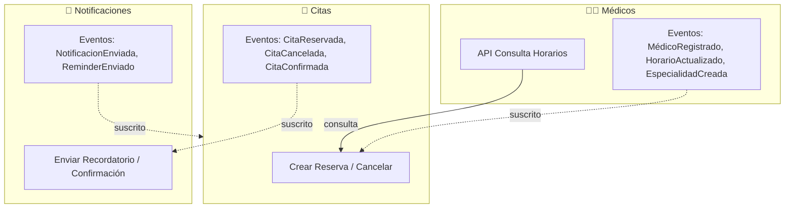
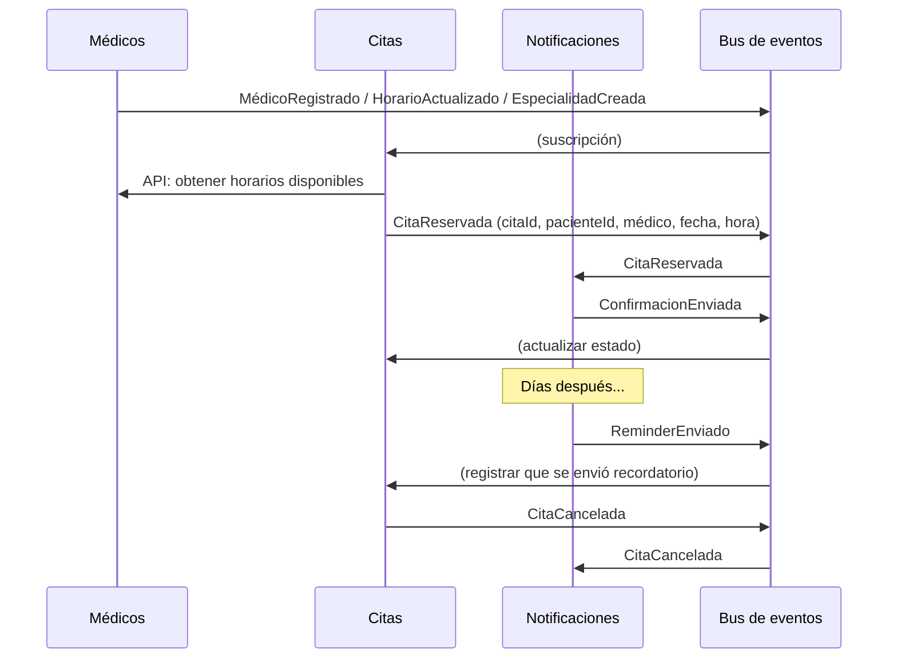

# Tarea #1: Contextos delimitados - Sistema de Reserva de Citas Médicas

Sistema ficticio para gestionar reservas de citas médicas. Tres contextos que se comunican por **APIs** (consulta) y **eventos** (publicación/suscripción).

## Tabla de contenidos

- [Sistema ficticio](#sistema-ficticio)
- [Contextos y documentación](#contextos-y-documentación)
- [Diagrama: interacción entre contextos](#diagrama-interacción-entre-contextos)
  - [Flujo de eventos (secuencia)](#flujo-de-eventos-secuencia)
- [Eventos por contexto](#eventos-por-contexto)
- [Resumen de cada contexto](#resumen-de-cada-contexto)
- [Justificación de la división](#justificación-de-la-división)

---

## Sistema ficticio

**"MediCitas"** es una plataforma de reserva de citas médicas en línea. Los pacientes pueden:

1. Explorar médicos disponibles y sus especialidades
2. Ver horarios disponibles
3. Reservar una cita médica
4. Recibir recordatorios y confirmaciones

El sistema funciona 24/7 pero los médicos solo atienden en horarios específicos. Cuando se reserva una cita, el paciente debe recibir confirmación inmediata y recordatorios días antes.

---

## Contextos y documentación

| Contexto           | Responsabilidad                                   | Documentación                                                  |
| ------------------ | ------------------------------------------------- | -------------------------------------------------------------- |
| **Médicos**        | Gestionar médicos, especialidades y horarios      | [01-contexto-medicos.md](01-contexto-medicos.md)               |
| **Citas**          | Gestionar la reserva y cancelación de citas       | [02-contexto-citas.md](02-contexto-citas.md)                   |
| **Notificaciones** | Enviar recordatorios y confirmaciones al paciente | [03-contexto-notificaciones.md](03-contexto-notificaciones.md) |

---

## Diagrama: interacción entre contextos

- **Líneas sólidas**: API (Citas consulta disponibilidad al Contexto de Médicos).
- **Líneas punteadas**: eventos (Médicos → Citas; Citas → Notificaciones).

### Flujo de eventos (secuencia)

---

## Eventos por contexto

| Contexto           | Emite                                                         | Consume                         |
| ------------------ | ------------------------------------------------------------- | ------------------------------- |
| **Médicos**        | MédicoRegistrado, HorarioActualizado, EspecialidadCreada      | —                               |
| **Citas**          | CitaReservada, CitaConfirmada, CitaCancelada, CitaActualizada | Eventos Médicos; Notificaciones |
| **Notificaciones** | ConfirmacionEnviada, ReminderEnviado, RechazoNotificacion     | CitaReservada, CitaCancelada    |

---

## Resumen de cada contexto

- **Médicos:** Gestiona profesionales médicos, sus especialidades y horarios disponibles. No sabe sobre pacientes específicos ni confirmaciones de citas.
- **Citas:** Gestiona reservas de pacientes. Consulta disponibilidad al contexto de Médicos. Un "médico" aquí es solo un ID y disponibilidad, no su perfil completo.
- **Notificaciones:** Envía mensajes. Una "cita" es solo un evento con datos para contactar al paciente, sin detalles médicos.

El mismo concepto cambia de significado por contexto:

| Concepto     | Médicos                     | Citas                      | Notificaciones             |
| ------------ | --------------------------- | -------------------------- | -------------------------- |
| **Médico**   | Perfil completo profesional | ID + especialidad + estado | Solo para contacto         |
| **Paciente** | Irrelevante                 | Entidad central            | Datos contacto (email/SMS) |
| **Horario**  | Agenda del médico           | Disponibilidad filtrada    | Irrelevante                |
| **Cita**     | Irrelevante                 | Reserva de paciente        | Evento a notificar         |

Un contexto delimitado protege el significado del modelo dentro de sus fronteras.

**Microservicios típicos:** Doctors Service, Appointments Service, Notifications Service — cada uno con su BD, modelo y comunicación por eventos o APIs.

---

## Justificación de la división

### ¿Por qué separar en 3 contextos?

1. **Médicos** es independiente de citas: Los médicos existen y tienen horarios incluso sin pacientes. Sus cambios (nuevo horario, nueva especialidad) deben propagarse a otros contextos.

2. **Citas** depende de **Médicos** (consulta disponibilidad) pero es el corazón del negocio: Gestiona la lógica de reserva, validación, cancelación. Su complejidad requiere un modelo propio.

3. **Notificaciones** es completamente desacoplada: Podría cambiar el canal (Email → SMS → Push notifications) sin afectar Médicos o Citas. Es reactiva a eventos, no consultiva.

### Razones de esta separación (Domain-Driven Design)

- **Lenguaje ubicuo diferente:** Cada contexto habla de sus conceptos de forma autónoma.
- **Responsabilidad única:** Cada equipo (o microservicio) tiene una responsabilidad clara.
- **Escalabilidad independiente:** Notificaciones puede procesarse en paralelo sin bloquear reservas.
- **Cambios sin acoplamiento:** Si cambiam la lógica de notificaciones, Médicos y Citas no se ven afectados.
