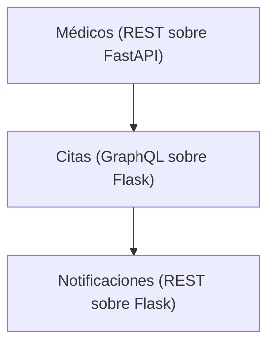

# Sistema de Reserva de Citas Médicas - MediCitas

## Una plataforma de reserva de citas médicas



- URL del servicio de Médicos: http://localhost:9090/docs
- URL del servicio de Citas: http://localhost:5001/graphql
- URL del servicio de Notificaciones: http://localhost:5002/apidocs

## Descripción de servicios

### Médicos (FastAPI)

- Gestiona el registro de médicos, especialidades y horarios disponibles
- Proporciona endpoints REST para consultar médicos y disponibilidad
- Base de datos: Información de médicos y sus horarios

### Citas (GraphQL - Flask)

- Gestiona la reserva y cancelación de citas médicas
- Proporciona interfaz GraphQL para consultas complejas de citas
- Se comunica con Médicos para validar disponibilidad
- Publica eventos de citas creadas/canceladas

### Notificaciones (Flask)

- Envía confirmaciones y recordatorios a pacientes
- Proporciona endpoints REST para gestionar notificaciones
- Se suscribe a eventos de Citas
- Base de datos: Historial de notificaciones enviadas

## Flujo de comunicación

1. **Cliente** → **Médicos**: Consulta disponibilidad
2. **Cliente** → **Citas**: Reserva una cita (valida con Médicos)
3. **Citas** → **Notificaciones**: Publica evento de cita creada
4. **Notificaciones**: Envía confirmación y recordatorios

## Comunicación entre servicios (HTTP)

La mutación `crearCita` del servicio **Citas** demuestra la comunicación con los otros dos servicios:

1. `Citas` → `GET http://medicos:9090/medicos/{id}` para validar que el médico existe y está disponible.
2. `Citas` → `POST http://notificaciones:5002/notificaciones` para registrar la confirmación.

Las URLs se inyectan vía variables de entorno (`MEDICOS_URL`, `NOTIFICACIONES_URL`) en `docker-compose.yml` y se resuelven por el DNS interno de Docker Compose.

### Ejemplo de prueba (GraphQL en `http://localhost:5001/graphql`)

```graphql
mutation {
  crearCita(
    medicoId: 1
    paciente: "Loreli Rojas"
    fecha: "2026-05-10"
    hora: "11:00"
  ) {
    id
    paciente
    estado
  }
}
```

Tras ejecutarla, consulta `http://localhost:5002/notificaciones` y verás la notificación de confirmación generada automáticamente por el servicio de Citas.

## Contextos delimitados

Consulta la documentación en Tarea 1 para más detalles:

- [Contexto de Médicos](../tarea1/01-contexto-medicos.md)
- [Contexto de Citas](../tarea1/02-contexto-citas.md)
- [Contexto de Notificaciones](../tarea1/03-contexto-notificaciones.md)
