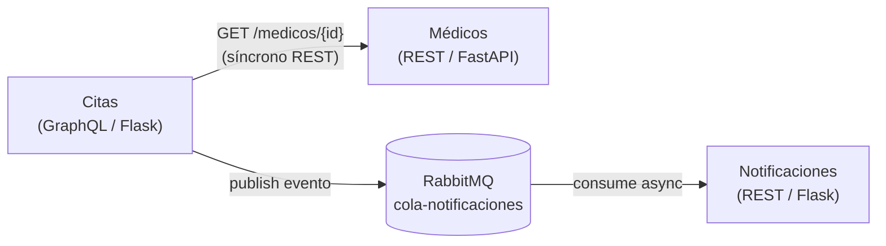

# Sistema de Reserva de Citas Médicas - MediCitas (Tarea 3 - Mensajería asíncrona)

## Una plataforma de reserva de citas médicas con comunicación asíncrona vía RabbitMQ



- URL del servicio de Médicos: http://localhost:9090/docs
- URL del servicio de Citas: http://localhost:5001/graphql
- URL del servicio de Notificaciones: http://localhost:5002/apidocs
- **RabbitMQ Management UI: http://localhost:15672** (usuario: `guest`, contraseña: `guest`)

## Cambios respecto a Tarea 2

En la Tarea 2 el servicio `Citas` notificaba a `Notificaciones` mediante una llamada **HTTP síncrona** (`POST /notificaciones`).

En esta Tarea 3 esa comunicación se sustituyó por **mensajería asíncrona** con **RabbitMQ**:

- `Citas` actúa como **publisher**: cuando se crea o cancela una cita, publica un evento JSON en la cola `cola-notificaciones`.
- `Notificaciones` actúa como **subscriber**: arranca un hilo en background que consume continuamente la cola y registra cada evento como una notificación.
- La validación de médicos (`Citas → Médicos`) sigue siendo **síncrona REST**, ya que se necesita la respuesta inmediata para confirmar la cita.

## Cómo levantar el sistema

```powershell
cd tarea3
docker compose up --build -d
```

Esto levanta 4 contenedores: `rabbitmq`, `medicos_service`, `citas_service`, `notificaciones_service`.

Para apagarlos:

```powershell
docker compose down
```

## Cómo probar la mensajería asíncrona

### 1. Verificar que RabbitMQ está corriendo

Abre http://localhost:15672 (usuario `guest` / contraseña `guest`) y entra a la pestaña **Queues**. Después de que `Notificaciones` arranque deberías ver la cola `cola-notificaciones` con 0 mensajes.

### 2. Disparar un evento desde Citas (publisher)

Abre http://localhost:5001/graphql y ejecuta la mutación:

```graphql
mutation {
  crearCita(
    medicoId: 1
    paciente: "Loreli Rojas"
    fecha: "2026-05-10"
    hora: "11:00"
  ) {
    id
    paciente
    estado
  }
}
```

`Citas` validará al médico contra `Médicos` (REST) y luego **publicará un mensaje JSON en la cola `cola-notificaciones`**.

### 3. Verificar que Notificaciones consumió el mensaje (subscriber)

Hay tres formas de comprobarlo:

**a) Vía REST en Notificaciones** (confirma que el evento se procesó):

```powershell
Invoke-WebRequest -UseBasicParsing http://localhost:5002/notificaciones | Select-Object -ExpandProperty Content
```

Deberías ver una nueva entrada con la cita recién creada.

**b) Vía logs del contenedor de Notificaciones** (confirma que el consumer recibió el mensaje):

```powershell
docker logs notificaciones_service --tail 20
```

Buscar líneas como:

```
INFO - Esperando mensajes en cola 'cola-notificaciones' (host=rabbitmq)...
INFO - Notificación creada desde RabbitMQ: {...}
```

**c) Vía RabbitMQ Management UI** (http://localhost:15672 → Queues → `cola-notificaciones`): el contador `Message rates → publish/deliver` reflejará el tráfico.

### 4. Probar que la mensajería desacopla los servicios

Para demostrar que la comunicación es **realmente asíncrona** (no bloqueante) puedes apagar Notificaciones, enviar varias mutaciones, y luego volver a levantarlo:

```powershell
docker compose stop notificaciones
# Ejecuta varias mutaciones crearCita en http://localhost:5001/graphql
# Observa en RabbitMQ UI que los mensajes se acumulan en la cola
docker compose start notificaciones
# Notificaciones procesará todos los mensajes pendientes al arrancar
```

Esto confirma que `Citas` no depende de la disponibilidad de `Notificaciones` para completar su operación.

## Estructura de los servicios

### Médicos (FastAPI)

- Gestiona médicos y disponibilidad. **No usa mensajería.**
- Endpoints REST consumidos por Citas.

### Citas (GraphQL - Flask) — _Publisher_

- Mutación `crearCita` y `cancelarCita` publican eventos en `cola-notificaciones`.
- Cliente RabbitMQ: librería `pika`.

### Notificaciones (Flask) — _Subscriber_

- Hilo background con `pika.BlockingConnection` que consume `cola-notificaciones`.
- Cada mensaje se persiste como notificación accesible vía REST en `/notificaciones`.
- Reconexión automática si RabbitMQ no está disponible.

## Contextos delimitados

Consulta la documentación en Tarea 1 para más detalles:

- [Contexto de Médicos](../tarea1/01-contexto-medicos.md)
- [Contexto de Citas](../tarea1/02-contexto-citas.md)
- [Contexto de Notificaciones](../tarea1/03-contexto-notificaciones.md)
